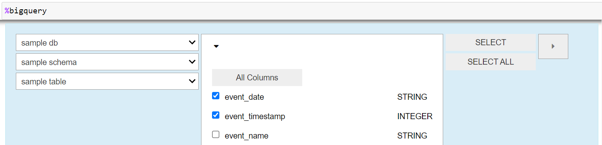

# dbt-magics
### What is dbt-magics?
dbt-magics is a python package that provides python line and cell magics when developing with dbt.
The magics allow you to create and run SQL commands against AWS Athena and Google BigQuery from within a Jupyter notebook or VSCode notebook.
So, instead of using the Athena Query Editor or the BigQuery Console, you can use the magics to run SQL commands directly from within your notebook. 

## Required IDE (one of the following)
- jupyter-notebook
- jupyter-lab
- VSCode (Notebook)

## Python dbt Package Requirements  
- dbt-core
- dbt-bigquery *(for bigquery magics)*
- dbt-athena-community  *(for athena magics)*

## Installation
```bash
pip install git+https://github.com/Tocha4/dbt-magics.git 
```

## Setup dbt
For setup instructions for AWS Athena and Google BigQuery, please see the [dbt documentation](https://docs.getdbt.com/docs/running-a-dbt-project/using-the-command-line-interface#section-2-configure-your-profile).

## Athena Magics
In order to use the Athena magics, you first have to load the magics into your notebook:

```python
# load the magics for athena into your notebook
%load_ext dbt_magics.athenaMagics
```

### Cell Magic
The line magic will run the SQL command and return the results as a pandas dataframe.
```python
%%athena
SELECT * FROM my_database.my_table
```
### Line Magic
The cell magic provides a visual dropdown interface that allows to select a specific database, table and its columns. Then, a SQL-Query is generated based on the selections. The SQL-Query can then be run using the line magic.
```python
%athena
```
### Docstring
Run the following command for the full docstring including the arguments
```python
%athena?
```

## BigQuery Magics
BigQuery magics are very similar to Athena magics. Yyou first have to load the magics into your notebook:

```python
# load the magics for bigquery into your notebook
%load_ext dbt_magics.bigqueryMagics
```

### Cell Magic
```python
%%bigquery
SELECT * FROM my_project.my_dataset.my_table
```

### Line Magic
```python
%bigquery
```

The image below shows an example of the interface for the cell magic.


### Docstring
```python
%bigquery?
```

## Contributing
In order to edit the code, please install the package in editable mode and run the command below:
```bash
pip install -e .
```